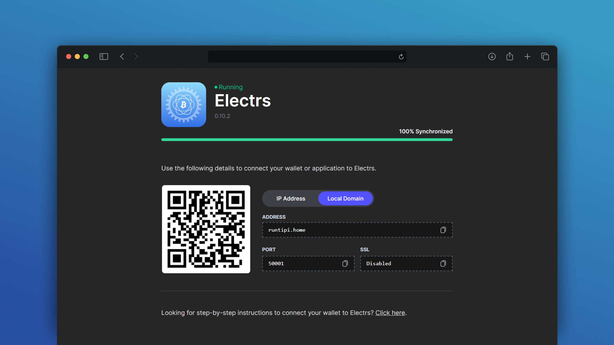

<p align="center">
  
  <h1 align="center">Electrs web UI</h1>
  <p align="center">
    Forked from: <i>https://github.com/getumbrel/umbrel-electrs</i>
  </p>
  <p align="center">
    Run an Electrum server on your personal server. Powered by Electrs.
  </p>

# Docker image
```
docker pull ghcr.io/montejojorge/electrs-ui:latest
```

## RPC Auth

You can use cookie or username/password authentication.

For cookie auth:
   - Bind the .bitcoin folder to the cointainer
   - And use BITCOIND_DIR enviroment variable (pointing to the container folder)

For username/password auth:
   - Use BITCOIND_RPC_PASSWORD and BITCOIND_RPC_USER enviroment variables (Avoid if posible)

# Docker compose usage with electrs
```
services:
   electrs-ui:
      container_name: electrs-ui
      image: ghcr.io/montejojorge/electrs-ui:v0.9.2
      volumes:
         - /home/user/.bitcoin:/data/.bitcoin:ro
      ports:
         - ${APP_PORT}:3006
      environment:
         BITCOIND_DIR: /data/.bitcoin
         ELECTRUM_LOCAL_DOMAIN: hostname.local
         ELECTRUM_IP_ADDRESS: 192.168.1.10
         ELECTRS_HOST: electrs
         BITCOIND_HOST: 192.168.1.10

  electrs:
      container_name: electrs
      image: getumbrel/electrs:v0.10.2
      volumes:
         - /home/user/.bitcoin:/data/.bitcoin:ro
         - /home/user/electrs:/data
      ports:
         - 50001:50001
      environment:
         - ELECTRS_COOKIE_FILE=/data/.bitcoin/.cookie
         - ELECTRS_DB_DIR=/data/db
         - ELECTRS_ELECTRUM_RPC_ADDR=0.0.0.0:50001
         - ELECTRS_LOG_FILTERS=INFO
         - ELECTRS_DAEMON_RPC_ADDR=192.168.1.10:8332
         - ELECTRS_DAEMON_P2P_ADDR=192.168.1.10:8333
```